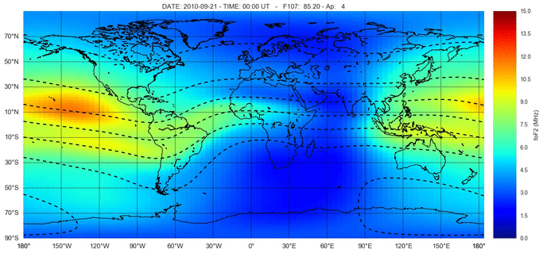
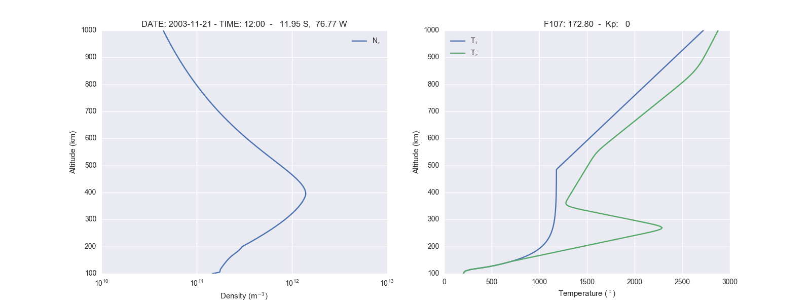
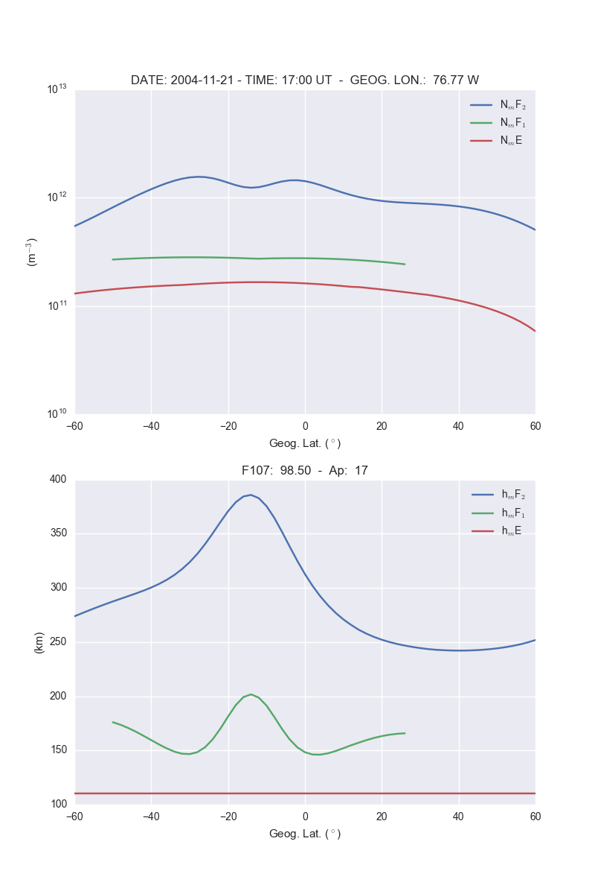
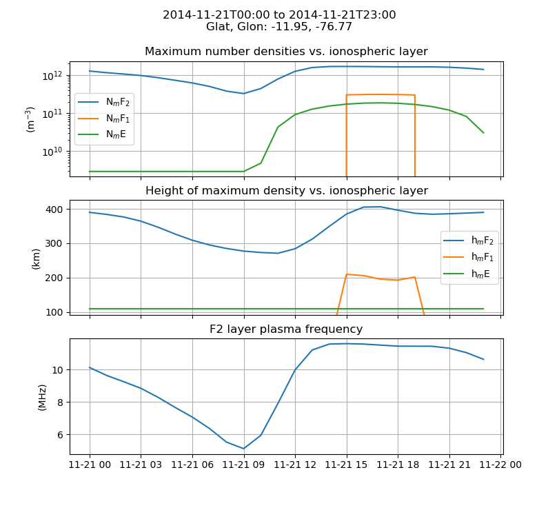
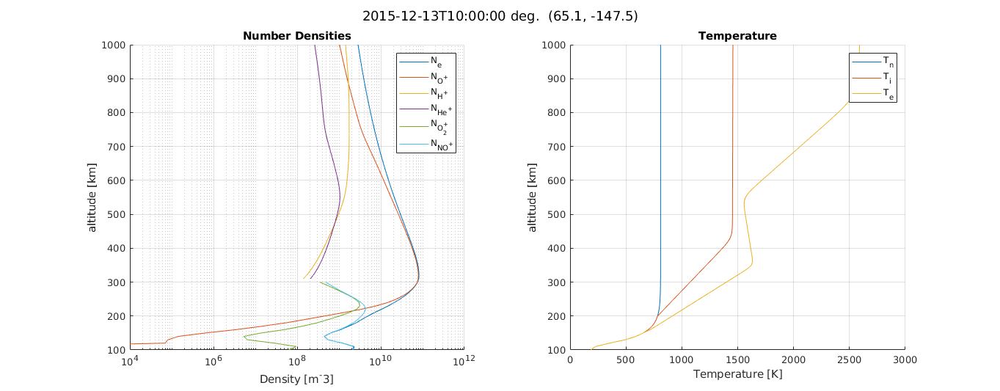

# IRI 2016 / 2020 / 2026 ionosphere models from Python and Matlab

Python and [Matlab](#matlab) interfaces to three generations of the
[International Reference Ionosphere (IRI)](https://irimodel.org) model:
**IRI-2016**, **IRI-2020**, and **IRI-2026** — packaged side by side with an
identical API, so results can be compared across model versions with a
one-word change.



Each model computes electron density, ion composition, electron/ion
temperatures, TEC, and ionospheric peak parameters (NmF2, hmF2, foF2, ...)
for a given time and location.

| Model | Python | Matlab |
|---|---|---|
| IRI-2016 | `import iri2016` | `iri2016.iri2016(...)` |
| IRI-2020 | `import iri2020` | `iri2020.iri2020(...)` |
| IRI-2026 | `import iri2026` | `iri2026.iri2026(...)` |

This repository is derived from
[space-physics/iri2016](https://github.com/space-physics/iri2016) (MIT
license), extended with the official IRI-2020 and IRI-2026 Fortran
distributions from [irimodel.org](https://irimodel.org), Windows build fixes,
and updated solar index files.

## Install

Prerequisites:

* **Fortran compiler** — any modern gfortran:
  * Linux: `apt install gfortran`
  * Mac: `brew install gcc`
  * Windows: [MSYS2](https://www.msys2.org/), then
    `pacman -S mingw-w64-x86_64-gcc-fortran mingw-w64-x86_64-make`
    and put `C:\msys64\mingw64\bin` on PATH
* **CMake** — `pip install cmake` works everywhere

Then:

```sh
git clone <this repository>
pip install -e .
```

The Fortran executables are built automatically **on first use** of each model
("build on run") and cached next to the package. On Windows they are linked
statically, so the resulting `.exe` files run from Matlab or any shell without
compiler DLLs on PATH. If the build picks the wrong compiler, set the `FC`
environment variable, or set `CMAKE_GENERATOR` to override the Windows default
of `MinGW Makefiles`.

## Usage: Python

Every model exposes the same functions — swap `iri2016` for `iri2020` or
`iri2026` anywhere below.

```python
import iri2020

ds = iri2020.IRI("2021-06-01T12", (100, 1000, 10), 65.1, -147.5)
#                 time            alt km (start, stop, step)  glat glon
print(ds)          # xarray.Dataset: ne, Te, Ti, ion composition, NmF2, hmF2, foF2, TEC, ...
```

Command-line plotting examples:

* Altitude profile: density and temperatures vs altitude

  ```sh
  python -m iri2016.altitude 2003-11-21T12 -11.95 -76.77
  ```

  
* Latitude profile: densities and altitude of the F2, F1 and E peaks vs geographic latitude

  ```sh
  python -m iri2016.latitude 2004-11-21T17 -76.77
  ```

  
* Time profile: densities and peak altitudes vs UTC

  ```sh
  python -m iri2016.time 2014-11-21 2014-11-22 1 -11.95 -76.77
  ```

  

Run the tests for all three models with:

```sh
pytest
```

## Matlab

The three `+iri2016`, `+iri2020`, `+iri2026` packages work directly from
Matlab (R2019b or newer). From the repository root:

```matlab
iono = iri2026.iri2026(datetime(2021,6,1,12,0,0), 65.1, -147.5, [100 1000 10]);
iri2026.plotiono(iono, datetime(2021,6,1,12,0,0), 65.1, -147.5)
```

Verify everything works:

```matlab
TestAll
```

The [Examples](./Examples) directory contains altitude- and time-profile
scripts for each model (`AltitudeProfile.m`, `AltitudeProfile2020.m`,
`AltitudeProfile2026.m`, and the `TimeProfile*.m` equivalents).



## Data files (important: valid date range)

IRI needs solar/geomagnetic index files to run:
`src/iriXXXX/data/index/{ig_rz.dat, apf107.dat}`. The copies in this
repository cover **January 1958 through November 2028** (measurements plus
official predictions). Requesting a date outside that range raises a
`ValueError` in Python (the Fortran model would otherwise return `-1` fill
values for everything).

The IRI project [updates these files monthly](https://irimodel.org/indices/).
To extend the valid date range, download the current `ig_rz.dat` and
`apf107.dat` from that page into each model's `data/index/` directory —
no rebuild needed.

## Notes

* The IRI-recommended option flags (`JF` switches) are set in each model's
  `src/iri_driver.f90`; edit and delete the built executable to reconfigure.
* IRI-2020 added the ROCSAT-1 vertical drift model (`rocdrift.for`); IRI-2026
  added the Ionospheric Bubble Probability model (`ibp_emp_coeffs.dat`,
  output in `oarr(92)`).

## License and citation

Two licenses apply:

* The Python/Matlab wrapper code is **MIT** licensed
  ([LICENSE.txt](./LICENSE.txt)) — © 2026 Tzu-Hsun Kao;
  © Michael Hirsch and Ronald Ilma (space-physics project).
* The IRI Fortran source and coefficient data are © the **International
  Reference Ionosphere** project (COSPAR/URSI); see
  `src/iriXXXX/src/00_iri-License.txt`. Scientific publications using
  results from this software should acknowledge the IRI Working Group and
  cite the paper describing the IRI version used, e.g.:
  * IRI-2016: Bilitza et al. (2017), *J. Space Weather Space Clim.*, 7, A16,
    doi:10.1051/swsc/2017015
  * IRI-2020: Bilitza et al. (2022), *Rev. Geophys.*, 60, e2022RG000792,
    doi:10.1029/2022RG000792
  * IRI-2026: see `src/iri2026/src/00readme.txt`

## Author

Maintained by **Tzu-Hsun Kao**, PhD student, Ann and H.J. Smead Aerospace
Engineering Sciences, University of Colorado Boulder.

The IRI-2020/2026 integrations, Windows build fixes, and packaging in this
repository were developed with the aid of **Claude Code** (Anthropic).
